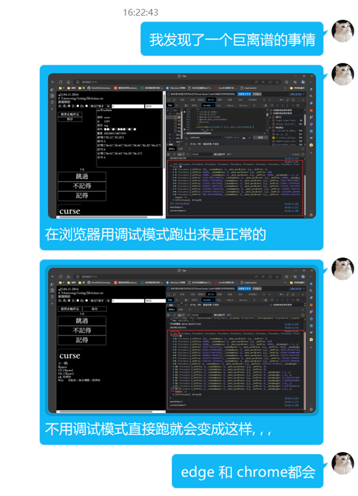
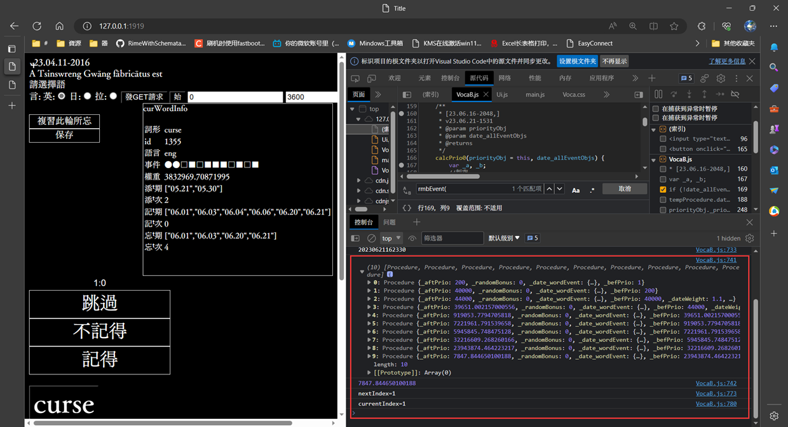
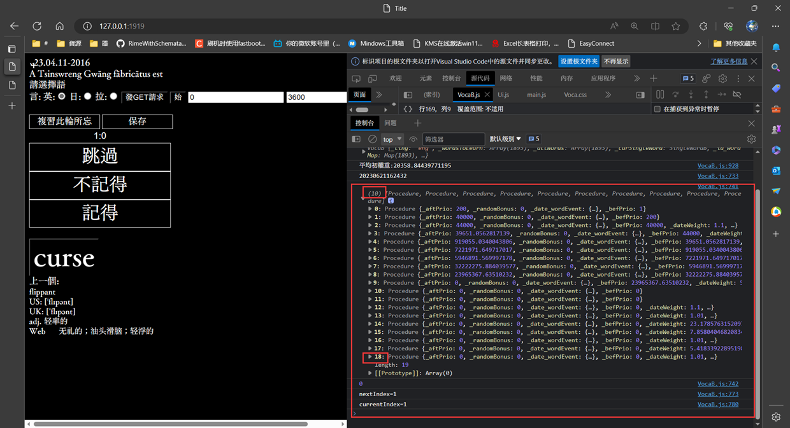

# voca

23.05.27-2247

## 文檔待補充

## 更新記錄

### 20230627221032 2.7.0

#### refactor:

* 移除了一些無關的文件

#### feat:

* 在項目根目錄中新增Root.ts、用來給項目文件夾的各級子目錄中的源文件提供項目根目錄的絕對路徑。棄用了2.6.2版本的`path.resolve(process.cwd())`

#### fix:

* 在添加單詞的部分修復了重大漏洞:
* VocaRaw中新增了幾個函數、用于臨時ᵈ 表ᵗ去重

最初、檢驗一個單詞是否 數據庫ʰ 已被添加過 時、用的sql是 

``` ts
	const qrySql = `SELECT *FROM ${this._tableName} WHERE wordShape = ?`
```

在這種情況下、`傾ける`和`傾げる`被視作相等。當時尚不知`BINARY`、遂改用

``` ts
let escaped = lodash.escapeRegExp(currentWordShape)
escaped = escaped.replace(/\\/g, '\\\\'); //把每個反斜槓都轉成兩個反斜槓
const qrySql = `SELECT *FROM ${this._tableName} WHERE wordShape REGEXP '^${escaped}$'`
```

能解決`傾ける`和`傾げる`不分的情況、並且長時間以來未發現問題。

但昨日把新單詞從txt中加進數據庫時發現有些單詞會被重複添加、佔據多行。究其故、發現`SELECT *FROM eng WHERE wordShape REGEXP '^exposé$'` 竟然匹配不到數據庫中已有的`exposé`一詞、導致該詞被複添並佔據多行。另外又發現這樣的sql語句默認不區別大小寫、導致`stem`和`STEM`被視作同一詞而合併。後又發現類似的諸問題在日語單詞表中更嚴重、複添者竟達數百個。

卒用

``` ts
	const qrySql = `SELECT *FROM ${this._tableName} WHERE wordShape = ?`
```

### 20230626101836 2.6.2

* 修複了讀單詞時路徑不正確的問題

### 20230625213816 2.6.1

* 補上了漏導的包

### 20230625162138 2.6.0

* 更改了項目結構、前後端源碼分離。

### 20230623231409 2.5.3

* 刪除了不必要的編譯生成的js文件
* 項目中新增文件夾src/views、日後將用vue重構

### 20230621212954 2.5.2

* 上一個版本不小心多註釋了兩條語句、導致按下按鈕後新日期未被錄入。現已修複。
* 取消了對初權重的臨時篩選
* 修改了debuff輸入框中的數字默認值。


### 20230621194614 2.5.1

* 新建Filter類、擬用于過濾單詞。
* defaultAddWeight默認值改爲200
* 優化了calcPrio0()方法、修複了少量bug、產生新事件後能計算新權重。
* 在項目文件中新建了一個word文檔

新bug:





我希望在點擊按鈕時在控制檯輸出單詞變化後的權重
不用調試模式時、開始複習單詞後點擊「記得」按鈕即發生此bug。

### 20230617220035 2.5.0

* 新增 類 DeemAsRemembered, PriorityConfig、將用來處理權重配置。
* Priority 類 中、重構了計算權重的函數、更名爲calcPrio0。將來版本中、當單詞獲得了新事件後能以此追加地計算新權重。

### 20230615231047 2.4.0

* 試用Promise修改了部分VocaRaw代碼、備份表格結束後能輸出結果。
* 改進了權重算法。
  - 更加了添加事件的權重計算規則、防止由連續重複添加事件產生過大的權重。
  - 日期權重的算法改用平方根而不用對數。
* 新增過濾功能。當一個單詞只有一個單詞事件 或 其權重低於設定值時、此單詞不會進入待復習的單詞列表中。
* 優化了生成隨機數組的方法。

### 20230613130851 2.3.0

* 支持用戶在右邊的輸入框中自定義debuffNumerator。默認值爲3600。
* 兩個輸入框(畀權重的隨機加成最大值max_randomBonus, debuffNumerator) 支持輸入js表達式。 例如可輸入3600*2 代替7200
* 注意: 只有當一個單詞的最後一個事件爲「憶」時纔能獲得debuff。

### 20230612212155 2.2.0

* 支持用戶自定義單詞權重隨機加成的範圍的最大值。在 界面中 開始按鈕旁的輸入框輸入最大值後再按開始按鈕即可生效。
* 只有一個單詞事件的單詞 將不會被復習到。

### 20230611164116 2.1.0

* 新增main.ts 用于存放全局變量等
* 新增Ui.ts 負責界面交互。原有之負責界面之函數被從VocaB中抽離。
* 調整了debuff之算法。詳見VocaB.ts中public getDebuff(durationOfLastRmbEventToNow)
